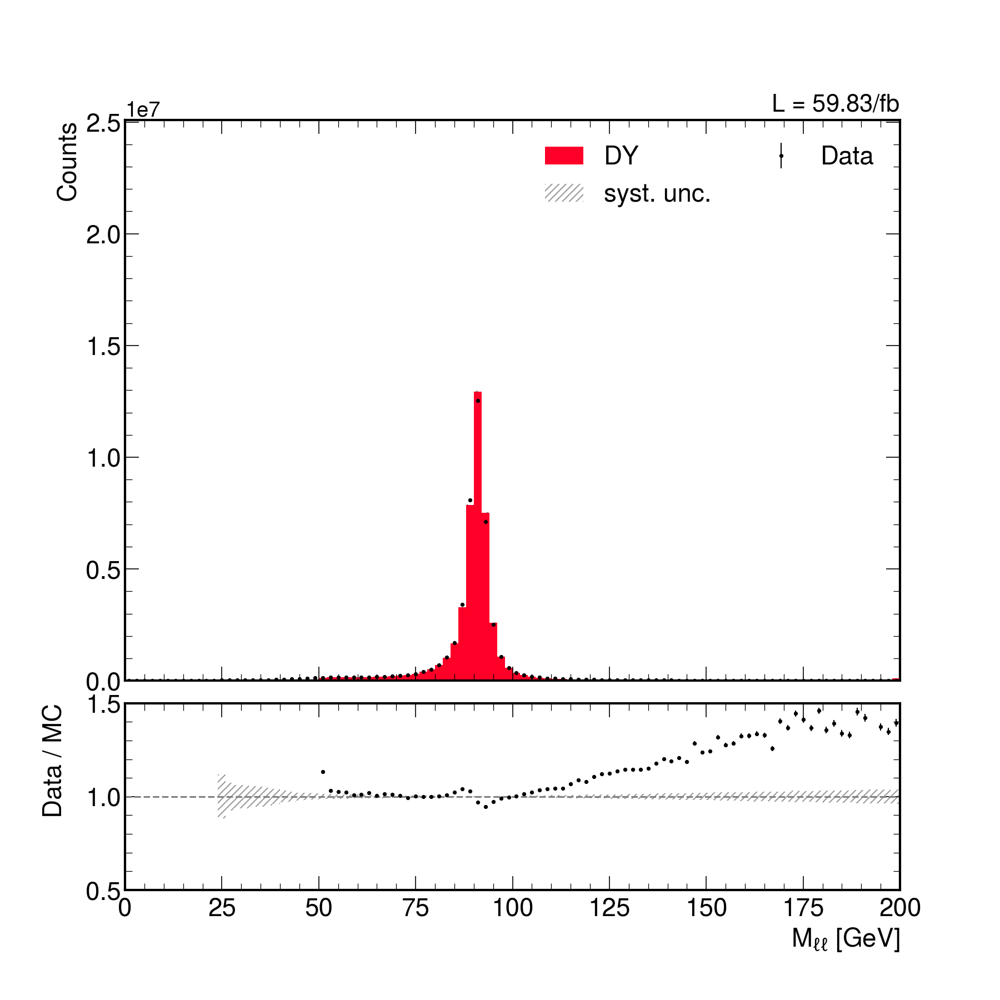

# Full analysis examples

Few analyses example, with increasing level of complexity are documented here and on the configuration repository: [AnalysisConfigs](https://github.com/PocketCoffea/AnalysisConfigs/)

A full example of all the steps needed to run a full analysis with PocketCoffea is reported, starting from the creation of the datasets list, the customization of parameters and the production of the final shapes and plots.
As an example, a toy example version of the Drell-Yan analysis targeting the $Z\rightarrow \mu\mu$ channel is implemented.

The main steps that need to be performed are the following:

* Build the json datasets
* Compute the sum of genweights for Monte Carlo datasets and rebuild json datasets
* Define selections: trigger, skim, object preselection, event preselection and categorization
* Define weights and variations
* Define histograms
* Run the processor
* Make the plots from processor output

## Installation
### Install PocketCoffea

PocketCoffea can be installed from pip or directly from the sources. The latter is needed if you wish to contribute to
the core of the framework code and to get the latest under development features.

:::{tip}
The environment needs to be set differently depending on the cluster where you want to run. Please refer to the detailed
guide [Installation guide](https://pocketcoffea.readthedocs.io/en/latest/installation.html).
:::

If you want to test it on lxplus just use the singularity image:

```bash
apptainer shell -B /afs -B /cvmfs/cms.cern.ch \
                -B /tmp  -B /eos/cms/  -B /etc/sysconfig/ngbauth-submit \
                -B ${XDG_RUNTIME_DIR}  --env KRB5CCNAME="FILE:${XDG_RUNTIME_DIR}/krb5cc" 
                /cvmfs/unpacked.cern.ch/gitlab-registry.cern.ch/cms-analysis/general/pocketcoffea:lxplus-el9-stable
```


:::{tip}
If you want just to test the analysis example or to work on an analysis configuration without modifying the central
code, you **don't need any other setup step**!
:::

If instead you want to install it from source, in order to be able to modify and contribute to the core framework code
you need to create a virtual environment. The recommended way of doing it is inside the singularity image as described
in [`Installation`](./installation.md).

```bash
git clone https://github.com/PocketCoffea/PocketCoffea.git
cd PocketCoffea
python -m venv myenv
source myenv/bin/activate

pip install -e .
#-e installs it in "editable" mode so that the modified files are included dynamically in the package.
```

:::{admonition} Setup the job submission with local core changes
:class: warning
**N.B.**: In order to properly propagated the local environment and local code changes to jobs running on condor through
Dask the user needs to setup the executor options properly with the `local-virtualenv: true` options. Checkout the
running instructions for more details [`Running`](./running.md).
:::


## Configuration files

The parameters specific to the analysis have to be specified in the configuration file.
This file contains a pure python dictionary named ``cfg`` that is read and manipulated by the ``Configurator`` module.

:::{tip}
Have a look at the [Configuration](./configuration.md) page for more detailed explanations.
:::

A dedicated repository  [`AnalysisConfigs`](https://github.com/PocketCoffea/AnalysisConfigs) collects the config files for
different analysis. Some analysis configs have been included in the main PocketCoffea repository for reference.

```bash
# Now downloading the example configuration
git clone https://github.com/PocketCoffea/AnalysisConfigs.git
cd AnalysisConfigs/configs/zmumu

# Ready to start!
```


A dedicated folder ``zmumu`` under the ``configs`` contains all the config files, the datasets definition json file, the
workflows files and possibly extra files with parameters that are needed for this tutorial analysis:

## Dataset preparation
### Build datasets metadata

The datasets of this analysis include a Drell-Yan Monte Carlo dataset and a ``SingleMuon`` dataset.
We have to look for the corresponding [DAS](https://cmsweb.cern.ch/das/) keys:

- `/DYJetsToLL_M-50_TuneCP5_13TeV-amcatnloFXFX-pythia8/RunIISummer20UL18NanoAODv9-106X_upgrade2018_realistic_v16_L1v1-v2/NANOAODSIM`
- `/SingleMuon/Run2018C-UL2018_MiniAODv2_NanoAODv9-v2/NANOAOD`

The list of datasets has to be written in a structured dictionary together with the corresponding metadata in a json
file.  This json file is then read by the ``builds-datasets`` command to produce the actual json datasets that are
passed as input to the Coffea processor.

:::{tip}
For a more detailed discussion about datasets, samples and their meaning in PocketCoffea,
see [Datasets handling](./datasets.md)
:::

The steps are the following:

1) Create a json file that contains the required datasets, `datasets_definitions.json`. Each entry of the dictionary
corresponds to a dataset. Datasets include a list of DAS keys, the output json dataset path and the metadata. In
addition a label `sample` is specified to assign a the "type" of events contained in the dataset (e.g. group QCD datasets from different
HT bins in a single sample).

The general idea is the following:

* The **dataset** key uniquely identifies a dataset.
* The **sample** key is the one used internally in the framework to categorize the type of the events contained in the
  dataset.
* The **json_output** key defines the path of the destination json file which will store the list of files.
* Several **files** entries can be defined for each dataset, including a list of DAS names and a dedicated metadata dictionary.
* The **metadata** keys should include:
	* For **Monte Carlo**: ``year``, ``isMC`` and ``xsec``.
	* For **Data**: ``year``, ``isMC``, ``era`` and ``primaryDataset``.


When the json datasets are built, the metadata parameters are linked to the files list, defining a unique dataset entry
with the corresponding files. The `primaryDataset` key for Data datasets is needed in order to apply a trigger
selection only to the corresponding dataset (e.g. apply the `SingleMuon` trigger only to datasets having
`primaryDataset=SingleMuon`).

The structure of the `datasets_definitions.json` file after filling in the dictionary with the parameters relevant to
our Drell-Yan and SingleMuon datasets should be the following:

```
{
   "DYJetsToLL_M-50":{
        "sample": "DYJetsToLL",
        "json_output"    : "datasets/DYJetsToLL_M-50.json",
        "files":[
            { "das_names": ["/DYJetsToLL_M-50_TuneCP5_13TeV-amcatnloFXFX-pythia8/RunIISummer20UL18NanoAODv9-106X_upgrade2018_realistic_v16_L1v1-v2/NANOAODSIM"],
              "metadata": {
                  "year":"2018",
                  "isMC": true,
		          "xsec": 6077.22,
                  "part": ""
                  }
            }
        ]
  },
    "DATA_SingleMuon": {
        "sample": "DATA_SingleMuon",
        "json_output": "datasets/DATA_SingleMuon.json",
        "files": [
             {
                "das_names": [
                    "/SingleMuon/Run2018A-UL2018_MiniAODv2_NanoAODv9-v2/NANOAOD"
                ],
                "metadata": {
                    "year": "2018",
                    "isMC": false,
                    "primaryDataset": "SingleMuon",
                    "era": "A"
                },
                "das_parents_names": [
                    "/SingleMuon/Run2018A-UL2018_MiniAODv2-v3/MINIAOD"
                ]
            },
            {
                "das_names": [
                    "/SingleMuon/Run2018B-UL2018_MiniAODv2_NanoAODv9-v2/NANOAOD"
                ],
                "metadata": {
                    "year": "2018",
                    "isMC": false,
                    "primaryDataset": "SingleMuon",
                    "era": "B"
                },
                "das_parents_names": [
                    "/SingleMuon/Run2018B-UL2018_MiniAODv2-v2/MINIAOD"
                ]
            },
            {
                "das_names": [
                    "/SingleMuon/Run2018C-UL2018_MiniAODv2_NanoAODv9-v2/NANOAOD"
                ],
                "metadata": {
                    "year": "2018",
                    "isMC": false,
                    "primaryDataset": "SingleMuon",
                    "era": "C"
                },
                "das_parents_names": [
                    "/SingleMuon/Run2018C-UL2018_MiniAODv2-v2/MINIAOD"
                ]
            },
            {....}
        ]
    }
}
```

2) To produce the json files containing the file lists, run the following command:

```bash
# if you are using singularity, create the ticket outside of it.
voms-proxy-init -voms cms -rfc --valid 168:0

pocket-coffea build-datasets --cfg datasets/datasets_definitions.json -o

# if you are running at CERN it is useful to restrict the data sources to Tiers closer to CERN
pocket-coffea build-datasets --cfg datasets/datasets_definitions.json -o -rs 'T[123]_(FR|IT|BE|CH|DE)_\w+'
```

Four ``json`` files are produced as output, two for each dataset: a version includes file paths with a specific prefix
corresponding to a site (querying Rucio for the availability of the files at the moment of running the script)
while another has a global redirector prefix (e.g. ``xrootd-cms.infn.it``), and is named with the suffix
`_redirector.json` If one has to rebuild the dataset to include more datasets, the extra argument ``--overwrite`` can be
provided to the script.

```bash
ls -lrt datasets/
total 129K
-rw-r--r-- 1   49K May  8 13:38 DYJetsToLL_M-50_2018.json
-rw-r--r-- 1   47K May  8 13:38 DYJetsToLL_M-50_redirector_2018.json
-rw-r--r-- 1   46K May  8 13:38 DYJetsToLL_M-50_local_2018.json
-rw-r--r-- 1  5.6K May 11 19:19 datasets_definitions.json~
-rw-r--r-- 1   49K May 11 19:20 DYJetsToLL_M-50.json
-rw-r--r-- 1   47K May 11 19:20 DYJetsToLL_M-50_redirector.json
-rw-r--r-- 1  144K May 11 19:21 DATA_SingleMuon.json
-rw-r--r-- 1  135K May 11 19:21 DATA_SingleMuon_redirector.json
-rw-r--r-- 1  3.0K May 11 19:22 datasets_definitions.json
```

There are more options to specify a regex to filter CMS Tiers or options to whitelist or blacklist sites. Moreover the
output jsons can be split automatically by year or kept together.

```bash
(pocket-coffea) ➜  zmumu git:(main) ✗ pocket-coffea build-datasets  -h
Usage: pocket-coffea build-datasets [OPTIONS]

  Build dataset fileset in json format

Options:
  --cfg TEXT                   Config file with parameters specific to the
                               current run  [required]
  -k, --keys TEXT              Keys of the datasets to be created. If None,
                               the keys are read from the datasets definition
                               file.
  -d, --download               Download datasets from DAS
  -o, --overwrite              Overwrite existing .json datasets
  -c, --check                  Check existence of the datasets
  -s, --split-by-year          Split datasets by year
  -l, --local-prefix TEXT
  -ws, --allowlist-sites TEXT  List of sites in whitelist
  -bs, --blocklist-sites TEXT  List of sites in blacklist
  -rs, --regex-sites TEXT      example: -rs 'T[123]_(FR|IT|DE|BE|CH|UK)_\w+'
                               to serve data from sites in Europe.
  -ir, --include-redirector    Use the redirector path if no site is available
                               after the specified whitelist, blacklist and
                               regexes are applied for sites.
  -p, --parallelize INTEGER
  --help                       Show this message and exit.
```


## Analysis configuration

### Parameters

PocketCoffea distinguishes between parameters for the analysis and specific runs configuration.
  - A *parameter* is considered something defining more in general a specific analysis and it is usually common between
different runs: e.g. HLT triggers, scale factors working points, JES/JER configuration.
  - A configuration is considered specific for a run of the analysis where the users applied selections, cleans objects
    and output histograms or arrays.

:::{tip}
Parameters are handled as *yaml* files with the [OmegaConf](https://omegaconf.readthedocs.io/en/latest/index.html)
utility library. A set of common and defaults are defined centrally by PocketCoffea and then the user can overwrite,
replace and add analysis specific configurations.  Have a look at the [Parameters](./parameters.md) page.
:::

This is done usually in the preamble of the analysis config file:

```python
import os
localdir = os.path.dirname(os.path.abspath(__file__))

# Loading default parameters
from pocket_coffea.parameters import defaults
default_parameters = defaults.get_default_parameters()
defaults.register_configuration_dir("config_dir", localdir+"/params")

parameters = defaults.merge_parameters_from_files(default_parameters,
                                                  f"{localdir}/params/object_preselection.yaml",
                                                  f"{localdir}/params/triggers.yaml",
                                                  update=True)

```

The `parameters` object can be manipulated freely by the user and then passed to the `Configurator` class to be used in
the analysis. The parameters are then **dumped** along with the analysis output to preserve them.

## Configuration

A specific analysis *run* is defined in PocketCoffea using an instance of a `Configurator`
[code](https://github.com/PocketCoffea/PocketCoffea/blob/main/pocket_coffea/utils/configurator.py#L20) class.
This class groups all the information about skimming, categorization, datasets, and outputs.
The next sections of the tutorial briefly describes how to configure it for the Zmumu analysis.

The configurator instance is created inside the main configuration file `example_config.py` and assigned to a variable
called `cfg`. This special name is used by the framework when the file is passed to the `pocket-coffea run` script to be
executed.


```python
from pocket_coffea.utils.configurator import Configurator
from pocket_coffea.lib.cut_definition import Cut
from pocket_coffea.lib.cut_functions import get_nObj_min, get_HLTsel
from pocket_coffea.parameters.cuts import passthrough
from pocket_coffea.parameters.histograms import *
from workflow import ZmumuBaseProcessor
from custom_cut_functions import *


cfg = Configurator(
    parameters = parameters,
    datasets = {
        "jsons": [f"{localdir}/datasets/DATA_SingleMuon.json",
                  f"{localdir}/datasets/DYJetsToLL_M-50.json"
                    ],
        "filter" : {
            "samples": ["DATA_SingleMuon",
                        "DYJetsToLL"],
            "samples_exclude" : [],
            "year": ['2018']
        }
    },
    #.....continues
    workflow = ZmumuBaseProcessor,
```

Datasets are specified by passing the list of json to be used and they can be filtered by year of sample type.

Parameters are also passed to the Configurator as well as the **workflow** class to be used in the processing.
This class is user defined in the `workflow.py` file locally in the folder.

## Define selections

The selections are performed at two levels:

* Object preselection: selecting the "good" objects that will be used in the final analysis (e.g. `JetGood`, `MuonGood`, `ElectronGood`...).
* Event selection: selections on the events that enter the final analysis, done in three steps:

   1) Skim and trigger: loose cut on the events and trigger requirements.
   2) Preselection: baseline event selection for the analysis.
   3) Categorization: selection to split the events passing the event preselection into different categories (e.g. signal region, control region).

## Object preselection

To select the objects entering the final analysis, we need to specify a series of cut parameters for the leptons and
jets in the file `params/object_preselection.yaml`. These selections include the $p_T$, $\eta$
acceptance cuts, the object identification working points, the muon isolation, the b-tagging working point, etc.

For the $Z\rightarrow \mu\mu$ analysis, we just use the standard definitions for the muon, electron and jet objects:

```yaml
object_preselection:
  Muon:
    pt: 15
    eta: 2.4
    iso: 0.25  #PFIsoLoose
    id: tightId

  Electron:
    pt: 15
    eta: 2.4
    iso: 0.06
    id: mvaFall17V2Iso_WP80

  Jet:
    dr_lepton: 0.4
    pt: 30
    eta: 2.4
    jetId: 2
    puId:
      wp: L
      value: 4
      maxpt: 50.0
    btag:
      wp: M

```

These parameters are used by the selector functions to filter the object collections in the `workflow.py` file.


## Event selection

In PocketCoffea, the event selections are implemented with a dedicated `Cut` object, that stores both the information of the cutting function and its input parameters.
Several factory ``Cut`` objects are available in ``pocket_coffea.lib.cut_functions``, otherwise the user can define their own custom ``Cut`` objects.


### Skim

The skim selection of the events is performed "on the fly" to reduce the number of processed events. At this stage we
also apply the HLT trigger requirements required by the analysis.  The following steps of the analysis are performed
only on the events passing the skim selection, while the others are discarded from the branch ``events``, therefore
reducing the computational load on the processor.  In the config file, we specify two skim cuts: one is selecting events
with at least one 18 GeV muon and the second is requiring the HLT ``SingleMuon`` path.

Triggers are specified in a parameter yaml files under the `params` dir (but the location is up to the user).
The parameters are then loaded and added to the default parameters in the preamble of `example_config.py`,  which we pass as an argument to the factory function ``get_HLTsel()``.


Moreover, standard selections as the following should be applied at the skim stage: 
- event flags for MC and Data
- number of primary vertex selection
- application of the golden JSON selection to Data lumisections

:::{warning}
The above skimming was applied by default until PocketCoffea v0.9.4. After that the user has to specify the skim cuts,
with Cut objects provided by the library.
:::


```python
from pocket_coffea.lib.cut_functions import get_nObj_min, get_HLTsel, eventFlags, get_nPVgood, goldenJson

cfg = Configurator(
    # .....

    skim = [
            eventFlags,
            goldenJson,
            get_nPVgood(1),
            get_nObj_min(1, 18., "Muon"),
            # Asking only SingleMuon triggers since we are only using SingleMuon PD data
            get_HLTsel(primaryDatasets=["SingleMuon"])],

```

### Event preselection

In the $Z\rightarrow \mu\mu$ analysis, we want to select events with exactly two muons with opposite charge. In addition, we require a
cut on the leading muon pT and on the dilepton invariant mass, to select the Z boson mass window.  The parameters are
directly passed to the constructor of the ``Cut`` object as the dictionary ``params``. We can define the function
``dimuon`` and the ``Cut`` object ``dimuon_presel`` in the preamble of the config script:

```python
def dimuon(events, params, year, sample, **kwargs):
    # Masks for same-flavor (SF) and opposite-sign (OS)
    SF = ((events.nMuonGood == 2) & (events.nElectronGood == 0))
    OS = events.ll.charge == 0$
    mask = (
       (events.nLeptonGood == 2)
       & (ak.firsts(events.MuonGood.pt) > params["pt_leading_muon"])
       & OS & SF
       & (events.ll.mass > params["mll"]["low"])
       & (events.ll.mass < params["mll"]["high"])
    )

    # Pad None values with False
    return ak.where(ak.is_none(mask), False, mask)

dimuon_presel = Cut(
    name="dilepton",
    params={
       "pt_leading_muon": 25,
       "mll": {'low': 25, 'high': 2000},
    },
    function=dimuon,
 )
```

In a scenario of an analysis requiring several different cuts, a dedicated library of cuts and functions can be defined
in a separate file and imported in the config file. This is the strategy implemented in the example (and recommended to
keep the config file minimal). Have a loot at the `custom_cut_functions.py` file.

The ``preselections`` field in the config file is updated accordingly:

```python
cfg = Configurator(
    # .....

    preselections = [dimuon_presel],
```

### Categorization

In the toy $Z\rightarrow \mu\mu$ analysis, no further categorization of the events is performed. Only a ``baseline`` category is
defined with the ``passthrough`` factory cut that is just passing the events through without any further selection:

```python
cfg = Configurator(
    # .....

    categories = {
        "baseline": [passthrough],
    },
```

If for example $Z\rightarrow ee$ events were also included in the analysis, one could have defined a more general "dilepton"
preselection and categorized the events as ``2e`` or ``2mu`` depending if they contain two electrons or two muons,
respectively.

## Define weights and variations

The application of the nominal value of scale factors and weights is switched on and off just
by adding the corresponding key in the ``weights`` dictionary:

```python
from pocket_coffea.lib.weights.common import common_weights

cfg = Configurator(
    # .....
    weights_classes = common_weights,  # optional
    
    weights = {
         "common": {
             "inclusive": ["genWeight","lumi","XS",
                           "pileup",
                           "sf_mu_id","sf_mu_iso",
                           ],
             "bycategory" : {
             }
         },
         "bysample": {
         }
     }
    )
```

In our case, we are applying the nominal scaling of Monte Carlo by ``lumi * XS / genWeight`` together with the pileup reweighting and the muon ID and isolation scale factors.
The reweighting of the events is managed by the module ``WeightsManager``.

The available weights are defined by the `weights_classes` argument of the Configurator. That is a list of WeightWrapper
objects that can be taken from the ones defined in the framework, or it can be customized by the users. 
The common weights defined by the framework are available in `pocket_coffea.lib.weights.common.common_weights`. 
If the user doesn't provide a list of weight classes, the common ones are used by default. 

:::{tip}
For more information about Weights customization have a look at the [Configuration](./configuration.md#Weights) docs.
:::

To store also the up and down systematic variations corresponding to a given weight, one can specify it in the ``variations`` dictionary:

```python
cfg = Configurator(
    # .....
    variations = {
        "weights": {
            "common": {
                "inclusive": [  "pileup",
                                "sf_mu_id", "sf_mu_iso"
                              ],
                "bycategory" : {
                }
            },
        "bysample": {
        }
        },
    },

```

In this case we will store the variations corresponding to the systematic variation of pileup and the muon ID and isolation scale factors.
These systematic uncertainties will be included in the final plots.

## Define histograms

In PocketCoffea histograms can be defined directly from the configuration:  look at the ``variable`` dictionary under
`example_config.py`.
Histograms are defined with the options specified in
[`hist_manager.py`](https://github.com/PocketCoffea/PocketCoffea/blob/main/pocket_coffea/lib/hist_manager.py#L30). An
histogram is a collection of `Axis` objects with additional options for excluding/including variables, samples, and
systematic variations.

:::{tip}
Histogram configuration is described in details [here](./configuration.md#histograms-configuration)
:::

In order to create a user defined histogram add `Axis` as a list (1 element for 1D-hist, 2 elements for 2D-hist)

```python

cfg = Configurator(
    # .....

   variables : {

           # 1D plots
           "mll" : HistConf( [Axis(coll="ll", field="mass", bins=100, start=50, stop=150, label=r"$M_{\ell\ell}$ [GeV]")]
    },

	# coll : collection/objects under events
	# field: fields under collections
	# bins, start, stop: # bins, axis-min, axis-max
	# label: axis label name
```

The `collection` is the name used to access the fields of the `events` main dataset (the NanoAOD Events tree). The `field` specifies the specific
array to use. If a field is global in the `events`, e.g. a user defined arrays in events, just use `coll=events`. Please
refer to the `Axis` [code](https://github.com/PocketCoffea/PocketCoffea/blob/main/pocket_coffea/lib/hist_manager.py#L12) for a complete description of the options.


- There are some predefined `hist` dictionaries ready to be built for the user:

```python

cfg = Configurator(
    # .....

   variables : {
        **count_hist(name="nJets", coll="JetGood",bins=8, start=0, stop=8),
	    # Muon kinematics
	    **muon_hists(coll="MuonGood", pos=0),
	    # Jet kinematics
        **jet_hists(coll="JetGood", pos=0),
    },

```


## Run the processor

Run the coffea processor to get ``.coffea`` output files. The ``coffea`` processor can be run locally or be scaled out
to clusters:
- ``iterative`` execution runs single thread locally and it useful for debugging
- ``futures`` execute the processor in multiple threads locally and it can be useful for fast processing of a small
  amount of file.
- ``dask@lxplus`` uses the dask scheduler with lxplus the configuration to send out workers on HTCondor jobs.

The executors are configured in `pocket_coffea/executors` module for a set of predefined grid-sites. Please get in
contact with the developers and open a PR if you want to include your specific site to the supported list.


:::{tip}
Have a look at [`Running`](./running.md) for more details about the configuration of the different executors.
:::

In this tutorial we **assume the use of lxplus**, but the example should work fine also on other sites with the
`iterative` or `futures` setup.  The Dask scheduler execution needs to be configured properly to send out jobs in your facility.


```bash
## First let's test the running locally with  --test for iterative processor with ``--limit-chunks/-lc``(default:2) and ``--limit-files/-lf``(default:1)
pocket-coffea run --cfg example_config.py --test --process-separately  -o output_test
```

We can now submit the full processing on the HTcondor cluster with dask:

```bash
## change the --executor and numbers of jobs with -s/--scaleout

pocket-coffea run --cfg example_config.py  --executor dask@lxplus  --scaleout 10  -o output_dask
```

The scaleout configurations really depends on cluster and schedulers with different sites(lxplus, LPC, naf-desy).
The default options for the executor `dask@lxplus` are contained [here](https://github.com/PocketCoffea/PocketCoffea/tree/main/pocket_coffea/parameters/executor_options_defaults.yaml).
But the user can add more custom run options with a .yaml file:

```bash
$> cat custom_run_options.yaml
queue: espresso
chunksize: 200000
scaleout: 20
```

Try now to run with custom options:
```bash
pocket-coffea run --cfg example_config.py --executor dask@lxplus --custom-run-options custom_run_options.yaml  -o output_dask
```


The output of the script will be similar to

```bash
$ pocket-coffea run --cfg example_config.py  --executor dask@lxplus --custom-run-options custom_run_options.yaml  -o output_dask

    ____             __        __  ______      ________
   / __ \____  _____/ /_____  / /_/ ____/___  / __/ __/__  ____ _
  / /_/ / __ \/ ___/ //_/ _ \/ __/ /   / __ \/ /_/ /_/ _ \/ __ `/
 / ____/ /_/ / /__/ ,< /  __/ /_/ /___/ /_/ / __/ __/  __/ /_/ /
/_/    \____/\___/_/|_|\___/\__/\____/\____/_/ /_/  \___/\__,_/


Loading the configuration file...
[INFO    ] Configurator instance:
  - Workflow: <class 'workflow.ZmumuBaseProcessor'>
  - N. datasets: 5
   -- Dataset: DATA_SingleMuon_2018_EraA,  Sample: DATA_SingleMuon, N. files: 92, N. events: 241608232
   -- Dataset: DATA_SingleMuon_2018_EraB,  Sample: DATA_SingleMuon, N. files: 51, N. events: 119918017
   -- Dataset: DATA_SingleMuon_2018_EraC,  Sample: DATA_SingleMuon, N. files: 56, N. events: 109986009
   -- Dataset: DATA_SingleMuon_2018_EraD,  Sample: DATA_SingleMuon, N. files: 194, N. events: 513909894
   -- Dataset: DYJetsToLL_M-50_2018,  Sample: DYJetsToLL, N. files: 204, N. events: 195510810
  - Subsamples:
   -- Sample DATA_SingleMuon: StandardSelection ['DATA_SingleMuon'], (1 categories)
   -- Sample DYJetsToLL: StandardSelection ['DYJetsToLL'], (1 categories)
  - Skim: ['nMuon_min1_pt18.0', 'HLT_trigger_SingleMuon']
  - Preselection: ['dilepton']
  - Categories: StandardSelection ['baseline'], (1 categories)
  - Variables:  ['MuonGood_eta_1', 'MuonGood_pt_1', 'MuonGood_phi_1', 'nElectronGood', 'nMuonGood', 'nJets', 'nBJets', 'JetGood_eta_1', 'JetGood_pt_1', 'JetGood_phi_1', 'JetGood_btagDeepFlavB_1', 'JetGood_eta_2', 'JetGood_pt_2', 'JetGood_phi_2', 'JetGood_btagDeepFlavB_2', 'mll']
  - available weights variations: {'DATA_SingleMuon': ['nominal', 'sf_mu_iso', 'pileup', 'sf_mu_id'], 'DYJetsToLL': ['nominal', 'sf_mu_iso', 'pileup', 'sf_mu_id']}
  - available shape variations: {'DATA_SingleMuon': [], 'DYJetsToLL': []}
Saving config file to output_all/config.json

# DASK output starts here
```


## Produce plots

Once the processing is done, the output folder looks like

```bash
(pocket-coffea) ➜  output_folder git:(main) ✗ ls -lrt
total 146M
-rw-r--r-- 1 user group  31K Jun 19 11:34 parameters_dump.yaml
-rw-r--r-- 1 user group 126K Jun 19 11:34 config.json
-rw-r--r-- 1 user group  20M Jun 19 11:34 configurator.pkl
-rw-r--r-- 1 user group 144M Jun 19 11:52 output_all.coffea
```

The parameters used in the processing are dumped, as well as a human-readable version of the config file in json format,
and a machine-readable `Configurator` object in `cloudpickle` format.

To produce plots, for each category and variable defined in the configuration a `pocket-coffea make-plots` script is available:

```bash
$ pocket-coffea make-plots --help

usage: pocket-coffea make-plots [-h] [--input-dir INPUT_DIR] [--cfg CFG] [-op OVERWRITE_PARAMETERS [OVERWRITE_PARAMETERS ...]] [-o OUTPUTDIR] [-i INPUTFILE] [-j WORKERS] [-oc ONLY_CAT [ONLY_CAT ...]] [-os ONLY_SYST [ONLY_SYST ...]] [-e EXCLUDE_HIST [EXCLUDE_HIST ...]] [-oh ONLY_HIST [ONLY_HIST ...]] [--split-systematics] [--partial-unc-band]
                     [--overwrite] [--log-x] [--log-y] [--density] [-v VERBOSE]

Plot histograms from coffea file

optional arguments:
  -h, --help            show this help message and exit
  --input-dir INPUT_DIR
                        Directory with coffea files and parameters
  --cfg CFG             YAML file with all the analysis parameters
  -op OVERWRITE_PARAMETERS [OVERWRITE_PARAMETERS ...], --overwrite-parameters OVERWRITE_PARAMETERS [OVERWRITE_PARAMETERS ...]
                        YAML file with plotting parameters to overwrite default parameters
  -o OUTPUTDIR, --outputdir OUTPUTDIR
                        Output folder
  -i INPUTFILE, --inputfile INPUTFILE
                        Input file
  -j WORKERS, --workers WORKERS
                        Number of parallel workers to use for plotting
  -oc ONLY_CAT [ONLY_CAT ...], --only-cat ONLY_CAT [ONLY_CAT ...]
                        Filter categories with string
  -os ONLY_SYST [ONLY_SYST ...], --only-syst ONLY_SYST [ONLY_SYST ...]
                        Filter systematics with a list of strings
  -e EXCLUDE_HIST [EXCLUDE_HIST ...], --exclude-hist EXCLUDE_HIST [EXCLUDE_HIST ...]
                        Exclude histograms with a list of regular expression strings
  -oh ONLY_HIST [ONLY_HIST ...], --only-hist ONLY_HIST [ONLY_HIST ...]
                        Filter histograms with a list of regular expression strings
  --split-systematics   Split systematic uncertainties in the ratio plot
  --partial-unc-band    Plot only the partial uncertainty band corresponding to the systematics specified as the argument `only_syst`
  --overwrite, --over   Overwrite plots in output folder
  --log-x               Set x-axis scale to log
  --log-y               Set y-axis scale to log
  --density             Set density parameter to have a normalized plot
  -v VERBOSE, --verbose VERBOSE
                        Verbose level for debugging. Higher the number more stuff is printed.
```


By running:

```bash
$ cd output
$ pocket-coffea make-plots -i output_all.coffea --cfg parameters_dump.yaml -o plots
```

all the plots are created in the `plots` folder.  The structure of the output and the dataset metadata dictionary
contained in the output file are used to compose the samples list forming the stack of histograms.

Additionally, one can customize the plotting style by passing a custom yaml file with the desired plotting options an additional argument:

```bash
$ pocket-coffea make-plots -i output_all.coffea --cfg parameters_dump.yaml -o plots -op plotting_style.yaml
```

More instructions on how to customize the plotting parameters in `plotting_style.yaml` can be found in the [Plotting](https://pocketcoffea.readthedocs.io/en/latest/plots.html) section.


