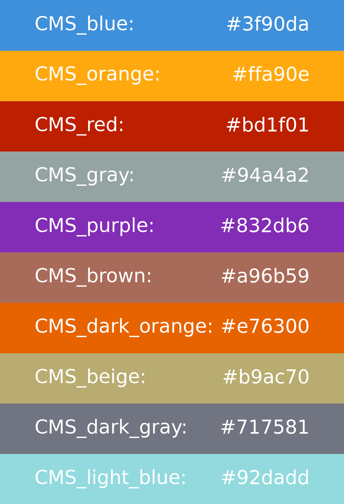

# Plotting

In order to produce Data/MC and MC comparison plots from the `.coffea` output file a dedicated `make_plots.py` script is implemented.

The plotting procedure is managed by several classes each targeting a specific task:

- `Shape`: for each histogram a `Shape` object is instantiated, storing all the relevant metadata and parameters.
- `SystUnc`: manages the systematic uncertainties. For each systematic uncertainty, a `SystUnc` object is instantiated. The up/down variations are stored in this object. These objects can be summed with each other to get their sum in quadrature.
- `PlotManager`: manages and stores several `Shape` objects to produce plots in all possible categories, exploiting multiprocessing.
- `SystManager`: manages several systematic uncertainties to get the total systematic uncertainty or MCstat only.

## Produce data/MC plots

Once the output `.coffea` file has been produced, plots can be generated by executing the plotting script. There are three possible way of executing it:
1. `make_plots.py`
By default, this command will read the output and configuration files from the current working directory (`./`): `output_all.coffea` is the default input file, `parameters_dump.yaml` is the default config file with all analysis parameters and `./plots` is the default output folder where the plots are saved.

2. `make-plots --input_dir $INPUT_DIR`
In this case, the input folder is passed as an input: `output_all.coffea`, `parameters_dump.yaml` are read from this folder and the plots are saved in the folder `$INPUT_DIR/plots`

3. `make-plots --input_dir $INPUT_DIR -i my_coffea_output.coffea --cfg parameters_dump.yaml -o plots_test -op plotting_style.yaml`
In this case, the default input files are overridden by providing the additional following arguments:

- `-i`: Input .coffea file with histograms.
- `--cfg`: `.yaml` file with all the analysis parameters (usually the `parameters_dump.yaml` file)
- `-o`: Output folder where the plots are saved.
- `-op`: `.yaml` file with plotting parameters to overwrite the default parameters (see details below).

Note that if `--input_dir` is not passed, the default value `./` will be assumed for the input folder.

Other optional arguments are:

- `-j`: Number of workers used for plotting
- `--only_cat`: Filter categories with a list of strings
- `--only_syst`: Filter systematics with a list of strings
- `--exclude_hist`: Exclude histograms with a list of regular expressions
- `--only_hist`: Filter histograms with a list of regular expressions
- `--split_systematics`: Split systematic uncertainties in the ratio plot
- `--partial_unc_band`: Plot only the partial uncertainty band corresponding to the systematics specified as the argument `only_syst`
- `--overwrite`: If the output folder is already existing, overwrite its content
- `--log-x`: Set x-axis scale to log
- `--log-y`: Set y-axis scale to log
- `--no-ratio`: Do not draw the ratio panel 
- `--density`: Set density parameter to have a normalized plot
- `--verbose`: Tells how much printing is done. 0 - for minimal, 2- for a lot (useful for debugging).

## Plotting parameters

The parameters of the default plotting style can be overwritten with a
new config, provided with an additional argument to the script with
`--overwrite_parameters plot_config.yaml` (also `-op` for short).

The structure of the additional `.yaml` config file has to be the following:
```
plotting_style:

    labels_mc:
        TTToSemiLeptonic: "$t\\bar{t}$ semilep."
        TTTo2L2Nu : "$t\\bar{t}$ dilepton"

    colors_mc:
        TTTo2L2Nu: [0.51, 0.79, 1.0]
        TTToSemiLeptonic: [1.0, 0.71, 0.24]

    samples_groups:
        ttbar:
           - TTTo2L2Nu
           - TTToSemiLeptonic

    exclude_samples:
        - TTToHadronic

    rescale_samples:
	    ttbar: 1.12
	    DY_LO: 1.33
		
    blind_hists:
        categories: [SignalRegion1, SignalRegion2]
        histograms:
            mjj: [100, 150]
            DNN: [0.7, 1]

    signal_samples:
        ZH_Hto2C_Zto2L: 10000

    print_info:
        category: True
        year: True

```

With `labels_mc` and `colors_mc` settings the user can define custom
labels for the MC samples and a custom coloring scheme.  

The `samples_groups` option allows for MC sub-samples to be merged
into a common sample by specifying a dictionary of those sub-samples.
In the example above, a single sample `ttbar` will be plotted by
merging the samples `TTTo2L2Nu` and `TTToSemiLeptonic`.  

Certain samples can be excluded from plotting with `exclude_samples` key.  

One could also rescale certain samples by a multiplicative factor,
using the `rescale_samples` keys.  

The `blind_hists` would remove points from `data` distributions in a
given range (set those bins to zero). One needs to specify a list of
categories where blinding should be implemented and the names of the histograms, as
shown in the example above.

With the `signal_samples` options one can define a list of samples
that are considered signals.  Then these samples would be also drawn
as a separate histogram (in addition to the stack MC hist). The
histogram is rescaled by the number specified.  

The `print_info` options would print a text on the plots for category
name and the year (era period).

In addition, all the default parameters related to the formatting of figures,
such as `opts_figure`, `opts_data`, `opts_mc`, `opts_sig`, `opts_syst`, `opts_unc` and
`opts_ylim`, can be overridden by passing custom parameters. For example, to set custom
limits on the y-axis of logarithmic plots, one can include this dictionary in the
`.yaml` file passed as the `-op` argument:
```
plotting_style:

    opts_ylim:
        datamc:
            ylim_log:
                lo: 0.01
                hi: 1000000
```

## Produce shape comparison plots

Oftentimes one wants to compare shapes of various MC samples, not the
Data/MC. The `make_plots.py` script is able to do this with a
`--compare` option. Note that in most cases it makes sense to use it
together with the `--density` option, otherwise the MC samples are
scaled to xs and have very dofferent scales.  

If the ratios are also desired then one have to add the following in
their `plotting.yaml` config:  
```
plotting_style:
    compare:
        ref: TTToHadronic
```

In this example the `ttbar` sample would be used as a reference when
making ratios, and all Ref/Others will be added in the ratio panel.
If this config is ommitted, the ratios are not drawn (an empty ratio panel
will be drawn, unless the `--no-ratio` option is explicitely provided).


## Default color scheme

The default color scheme adopted for plotting is the one recommended by
the [CMS guidelines](https://cms-analysis.docs.cern.ch/guidelines/plotting/colors/#categorical-data-eg-1d-stackplots).
Two color schemes with 6 and 10 colors respectively are used depending on the number of samples.

A set of user-friendly aliases is defined such that the user can use the colors recommended
by CMS just by an alias string, with no need to know the hexadecimal color codes.
The aliases are indicated in the figure below on top of the corresponding color:



Usage in the `.yaml` config file:
```
plotting_style:

    colors_mc:
        TTTo2L2Nu: CMS_red
        TTToSemiLeptonic: CMS_blue
```

If no alias or default `matplotlib` color corresponds to the string specified by the user,
an exception is raised.

## Additional custom axes

In order to include an additional custom axis in the plotting, one has to specify the dictionary of categorical axes for data and MC separately.
For example, to include an additional axis for data to keep track of different data-taking eras as an additional category, one can overwrite the custom `.yaml` file as follows:

```
plotting_style:

    categorical_axes_data:
        era: eras
```

where the key (`era`) in the dictionary corresponds to the name of the axis as saved in the histogram, while the value (`eras`) corresponds to the name assigned to the corresponding attribute of the `Shape` object.
